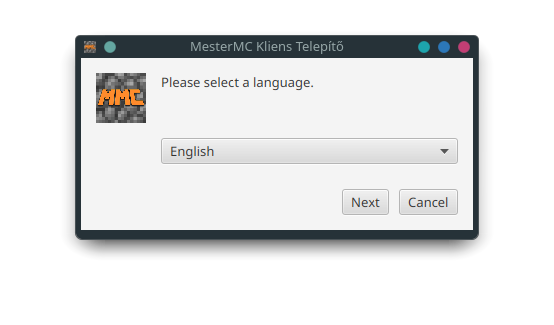
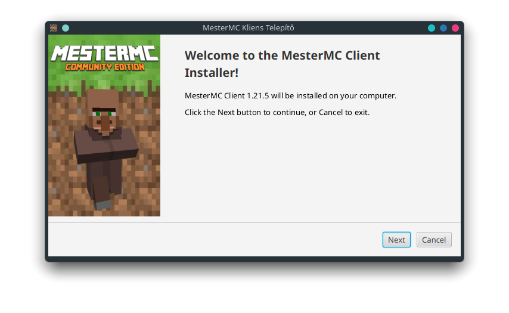
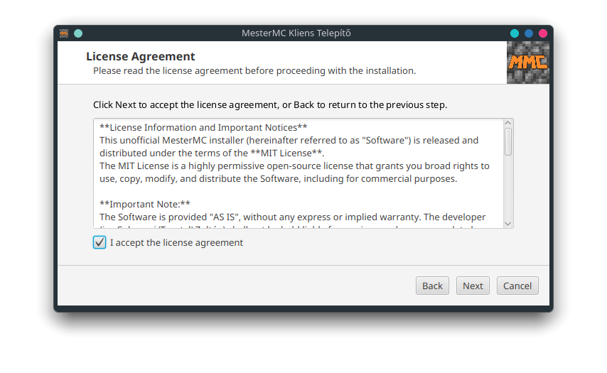
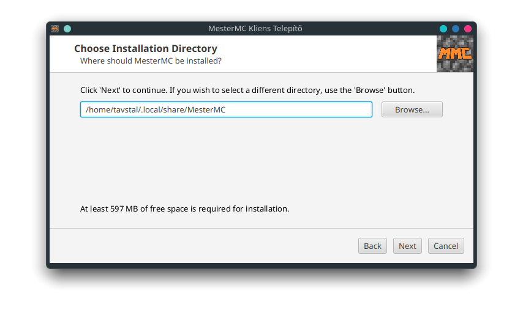
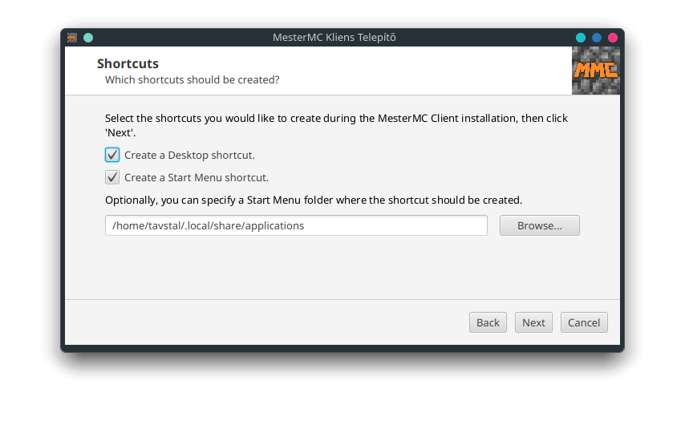
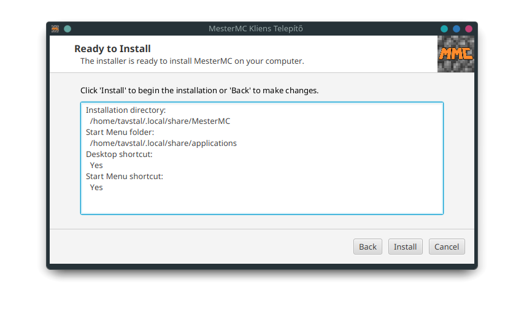
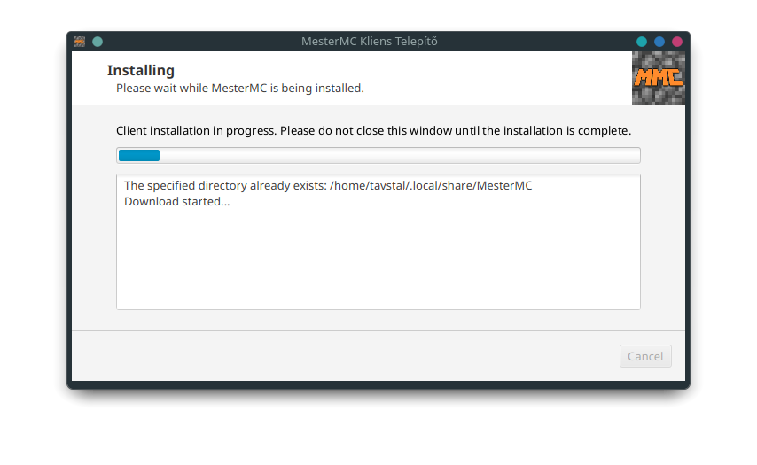
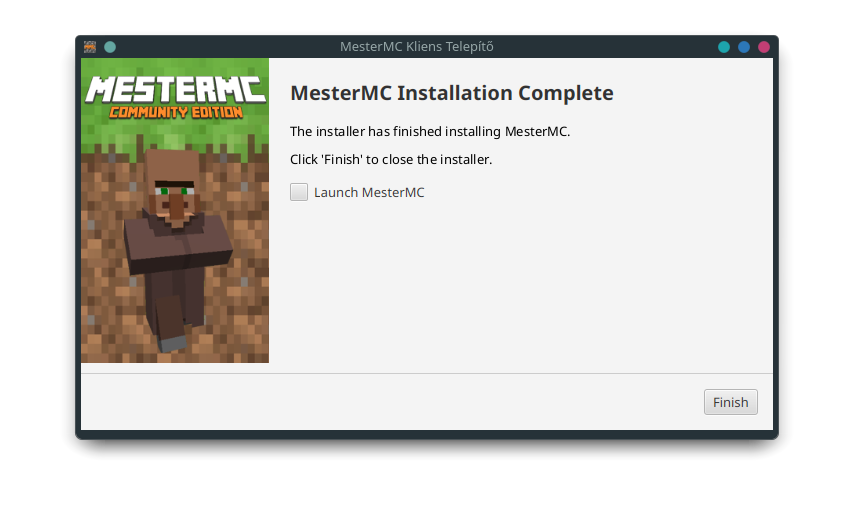

# MesterMC Installer

[](https://github.com/TavstalDev/MesterMC-Installer/blob/master/README_HUN.md)


[]()

The **MesterMC Installer** is a cross-platform solution designed to simplify the installation of the MesterMC launcher on various operating systems. While the original MesterMC installer primarily supports Windows, this installer extends compatibility to Linux and macOS, ensuring a broader user base can easily set up their game client.

## ✨ Features

* **Cross-Platform Compatibility:** Install MesterMC seamlessly on Windows, Linux, and macOS.
* **User-Friendly Graphical Interface:** A clear and intuitive step-by-step wizard guides you through the installation process.
* **Customizable Installation Path:** Choose where you want to install the MesterMC launcher.
* **Shortcut Creation:** Opt to create convenient desktop and/or Start Menu shortcuts.
* **License Agreement Display:** Review and accept the MesterMC license directly within the installer.
* **Installation Progress Tracking:** Monitor the progress of your installation in real-time.
* **Auto-Launch Option:** Launch MesterMC immediately after the installation completes.
* **Dependency Management:** Handles necessary system interactions for a smooth setup.

## 🖥️ Supported Operating Systems

This installer is designed to work on:

* **Windows**
* **Linux**
* **macOS**

## 🚀 Getting Started

### Prerequisites

To run the MesterMC Installer, you need to have **JDK 21 or higher** installed on your system.
* **Oracle JDK** is highly recommended.
* **Red Hat JDK is incompatible** with this installer.

### Installation & Usage

1.  **Download the Installer:**
    * **Windows:** Download the `MesterMC-Installer-v1.0.0-win.zip` file. Extract it, and run the `MesterMC-Installer.exe` executable.
    * **MacOS:** Download the `MesterMC-Installer-v1.0.0-macos.zip` file. Extract it, and run the `MesterMC-Installer.app` app image.
    * **Linux:** Download the `MesterMC-Installer-v1.0.0-linux.tar.gz` or the `MesterMC-Installer-v1.0.0-linux.AppImage` file.
    * * **AppImage:**
    * * * **A. via Terminal:**
    ```bash
    chmod +x MesterMC-Installer-v1.0.0-linux.AppImage
    ./MesterMC-Installer-v1.0.0-linux.AppImage
    ```
    * * * **B. via File Manager:** Right-click the `.AppImage` file, select "Properties", go to the "Permissions" tab, and check "Allow executing file as program". Then double-click the file to run it.
    * * * **C. via AppImageLauncher:** If you have AppImageLauncher installed, you can simply double-click the `.AppImage` file, and it will handle for you.
    * * **.tar.gz:** Download the `.tar.gz` file. Extract it, and run the `bin/MesterMC-Installer` AppImage in the extracted directory.

2.  **Follow the On-Screen Instructions:**
    The installer will guide you through the following steps:
    * **Welcome Screen:** Greet you and provide an overview.
    * **License Agreement:** Present the MesterMC license for your review and acceptance.
    * **Installation Path Selection:** Allow you to choose the desired directory for MesterMC.
    * **Shortcut Options:** Configure desktop and/or Start Menu shortcuts (if applicable to your OS).
    * **Review Installation:** Summarize your chosen options before proceeding.
    * **Installation Progress:** Display the ongoing installation process.
    * **Installation Complete:** Confirm successful installation and offer to launch MesterMC.

## 🛠️ Technologies Used

* **JavaFX:** For building the cross-platform graphical user interface.
* **Apache HttpClient:** For handling HTTP requests (e.g., checking `.jar` file size).
* **FXML:** For declarative UI design.
* **PowerShell:** Utilized for specific system interactions, such as creating shortcuts on Windows.
* **AppImage:** For packaging the application on Linux.

## 🤝 Contributing

We welcome contributions to the MesterMC Installer project!

Please follow the [Getting Started Guide](https://github.com/TavstalDev/MesterMC-Installer/blob/master/docs/building/getting-started.md) to set up the project in your local environment.

## 📸 Screenshots










## 📜 License

This project is licensed under the **MIT License**. See the `LICENSE` file for details.

## ⚠️ Disclaimer

**This MesterMC Installer is a fan-made project and is NOT officially affiliated with or endorsed by the original MesterMC team or its creators.**

## ❓ Support & Contact

If you encounter any issues or have questions, please feel free to:

* **Open an issue** on the [GitHub Issues page](https://github.com/tavstal/mmcinstaller/issues).
* **Contact me**
* * **Discord:** @Tavstal (Preferred, but not required)
* * **Twitter X:** [@Tavstal](https://x.com/Tavstal)

## ⛏️ MesterMC Official Links
* **Website:** [MesterMC](https://mestermc.hu/)
* **Installer:** [MesterMC Installer](https://mestermc.eu/)
* **Discord:** [MesterMC Discord](https://discord.gg/mestermc)